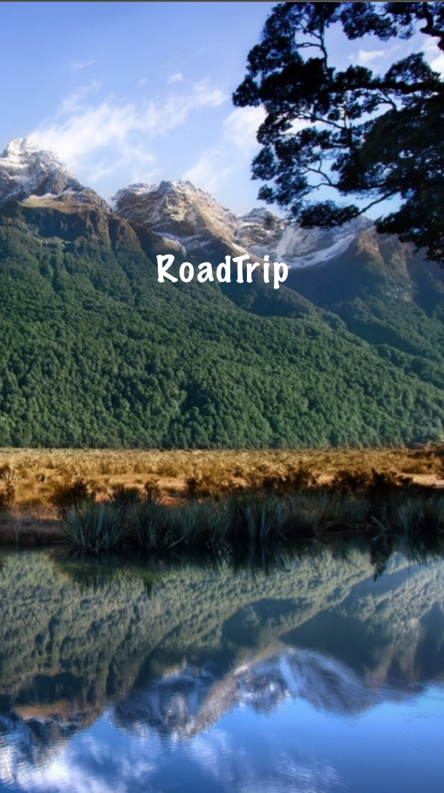

# Projet : Réalisez un projet libre à impact social
## RoadTrip

  

**Compétences évaluées**
-

- Identifier et mener un projet à impact social
- Mobiliser ses compétences au profit de la réalisation d’un projet
- Communiquer avec une base de données pour stocker et requêter des informations
- EventKit, Core Data, POO, POP, Alamofire, Rest API, UIKit, CocoaPods, Unit Testing, Xcode 11, Swift 5, iOS 11.

**Competencies evaluated**
-

- Identify and conduct a social impact project
- Mobilize skills for project delivery
- Communicate with a database to store and request information
- EventKit, Core Data, POO, POP, Alamofire, Rest API, UIKit, CocoaPods, Unit Testing, Xcode 11, Swift 5, iOS 11.

| RoadTrip | Search Places | My Trip | Details | Packing List |
| -------- | ------------- | ------- | ------- | ------------ |
| |  |  |  |  |